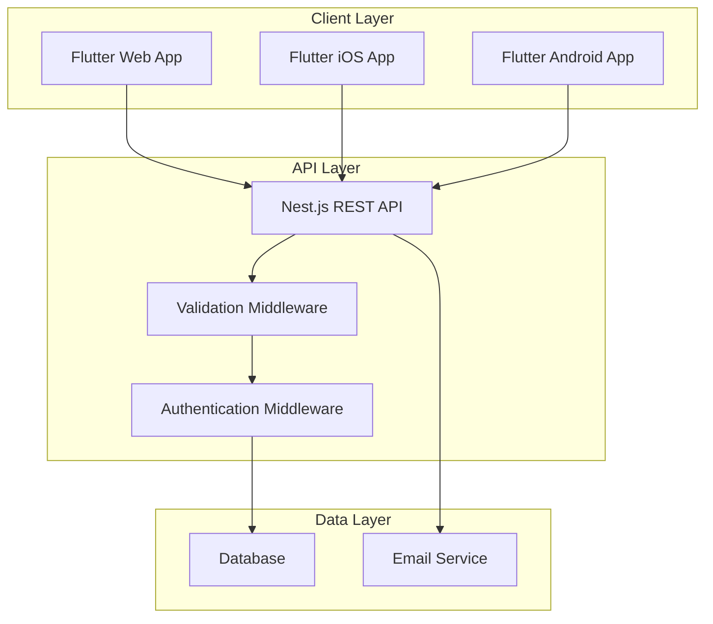

# Design Document: Debriefly

## Overview

Debriefly is a cross-platform application for creating, managing, and sharing structured post-meeting debrief reports. The system consists of a Flutter frontend (supporting iOS, Android, and Web) and a Nest.js backend with RESTful API endpoints.

### Core Functionality

The application enables users to:

- Create structured debrief reports with standardized fields (client name, meeting date, participants, summary, decisions, action items, risks)
- Store and retrieve debrief data persistently through a backend API
- View debriefs in a dashboard with search and filtering capabilities
- Access individual debrief details through unique URLs
- Share debriefs via copyable links and email

### Design Philosophy

The design emphasizes:

- **Simplicity**: Minimal, focused UI with clear information hierarchy
- **Speed**: Fast debrief creation and retrieval with efficient data structures
- **Shareability**: Easy distribution through URLs and email
- **Consistency**: Unified design language across all platforms (dark navy, white, warm amber palette)

## Architecture

### System Architecture



### Technology Stack

**Frontend:**

- Flutter SDK (latest stable)
- State Management: Provider or Riverpod
- HTTP Client: dio package
- Form Validation: flutter_form_builder
- Date Picker: flutter_datetime_picker
- URL Launcher: url_launcher (for email)

**Backend:**

- Nest.js framework
- TypeScript
- Database: PostgreSQL (recommended) or MongoDB
- ORM: TypeORM (PostgreSQL) or Mongoose (MongoDB)
- Email: nodemailer or SendGrid
- Validation: class-validator and class-transformer

### Architectural Patterns

**Frontend:**

- **MVVM (Model-View-ViewModel)**: Separates UI from business logic
- **Repository Pattern**: Abstracts data access through DebriefRepository
- **Service Layer**: Handles API communication through DebriefService

**Backend:**

- **Layered Architecture**: Controllers → Services → Repositories
- **DTO Pattern**: Data Transfer Objects for request/response validation
- **Dependency Injection**: Nest.js built-in DI container

## Components and Interfaces

### Frontend Components

#### 1. Dashboard Screen

**Responsibility**: Display list of debriefs with search and filter capabilities

**Key Components:**

- `DashboardScreen`: Main container widget
- `DebriefCard`: Individual debrief list item
- `SearchBar`: Text input for filtering
- `DateRangeFilter`: Date range selection widget
- `EmptyState`: Displayed when no debriefs match criteria

**State:**

- List of debriefs
- Search query string
- Date range filter (start, end)
- Loading state
- Error state

**Interactions:**

- Fetch debriefs on mount
- Filter debriefs on search input change
- Filter debriefs on date range change
- Navigate to detail view on card tap
- Navigate to creation form on FAB tap

#### 2. Debrief Form Screen

**Responsibility**: Create and edit debrief reports

**Key Components:**

- `DebriefFormScreen`: Main container widget
- `ClientNameField`: Text input
- `MeetingDatePicker`: Date selection widget
- `ParticipantsField`: Comma-separated text input
- `BulletPointField`: Multi-line text area with bullet point support
- `ActionItemList`: Dynamic list of action items
- `ActionItemRow`: Single action item with description, owner, due date
- `SubmitButton`: Form submission (enabled/disabled based on validation)

**State:**

- Form field values (clientName, meetingDate, participants, summary, decisions, actionItems, risks)
- Validation errors per field
- Form submission state (idle, submitting, success, error)

**Validation Rules:**

- Client Name: Required, non-empty
- Meeting Date: Required, valid date
- Participants: Optional
- Summary: Optional
- Decisions Made: Optional
- Action Items: If present, each must have description, owner, and due date
- Risks/Concerns: Optional

#### 3. Detail View Screen

**Responsibility**: Display complete debrief information with sharing options

**Key Components:**

- `DetailViewScreen`: Main container widget
- `DebriefHeader`: Client name and meeting date
- `ParticipantsSection`: List of participants
- `SummarySection`: Bullet points
- `DecisionsSection`: Bullet points
- `ActionItemsSection`: Table/list of action items
- `RisksSection`: Text content
- `ShareButton`: Copy link action
- `EmailButton`: Email sharing action
- `EmailModal`: Dialog for email composition

**State:**

- Debrief data
- Loading state
- Copy link success state
- Email modal visibility
- Email sending state

#### 4. Email Modal

**Responsibility**: Compose and send debrief via email

**Key Components:**

- `EmailModal`: Dialog container
- `RecipientField`: Multi-email input
- `SendButton`: Submit email
- `CancelButton`: Close modal

**State:**

- Recipient email addresses (array)
- Validation errors
- Sending state

### Backend Components

#### 1. DebriefController

**Responsibility**: Handle HTTP requests and responses

**Endpoints:**

```typescript
POST   /debriefs          - Create new debrief
GET    /debriefs          - Get all debriefs for user
GET    /debriefs/:id      - Get single debrief by ID
PUT    /debriefs/:id      - Update existing debrief
DELETE /debriefs/:id      - Delete debrief
POST   /debriefs/:id/email - Send debrief via email
```

**Methods:**

- `create(createDebriefDto: CreateDebriefDto): Promise<Debrief>`
- `findAll(userId: string): Promise<Debrief[]>`
- `findOne(id: string): Promise<Debrief>`
- `update(id: string, updateDebriefDto: UpdateDebriefDto): Promise<Debrief>`
- `remove(id: string): Promise<void>`
- `sendEmail(id: string, emailDto: EmailDebriefDto): Promise<void>`

#### 2. DebriefService

**Responsibility**: Business logic for debrief operations

**Methods:**

- `create(createDebriefDto: CreateDebriefDto, userId: string): Promise<Debrief>`
- `findAll(userId: string): Promise<Debrief[]>`
- `findOne(id: string): Promise<Debrief>`
- `update(id: string, updateDebriefDto: UpdateDebriefDto): Promise<Debrief>`
- `remove(id: string): Promise<void>`
- `formatForEmail(debrief: Debrief): string`

#### 3. EmailService

**Responsibility**: Send emails with debrief content

**Methods:**

- `sendDebriefEmail(recipients: string[], subject: string, content: string): Promise<void>`

#### 4. DebriefRepository

**Responsibility**: Database operations

**Methods:**

- `create(debrief: Debrief): Promise<Debrief>`
- `findAll(userId: string): Promise<Debrief[]>`
- `findById(id: string): Promise<Debrief | null>`
- `update(id: string, debrief: Partial<Debrief>): Promise<Debrief>`
- `delete(id: string): Promise<void>`

### API Interfaces

#### Request DTOs

```typescript
// CreateDebriefDto
{
  clientName: string;          // Required
  meetingDate: Date;           // Required
  participants: string;        // Optional, comma-separated
  summary: string[];           // Optional, array of bullet points
  decisionsMade: string[];     // Optional, array of bullet points
  actionItems: ActionItem[];   // Optional, array of action items
  risksConcerns?: string;      // Optional
}

// ActionItem
{
  description: string;         // Required
  owner: string;               // Required
  dueDate: Date;               // Required
}

// UpdateDebriefDto
{
  clientName?: string;
  meetingDate?: Date;
  participants?: string;
  summary?: string[];
  decisionsMade?: string[];
  actionItems?: ActionItem[];
  risksConcerns?: string;
}

// EmailDebriefDto
{
  recipients: string[];        // Required, array of email addresses
}
```

#### Response DTOs

```typescript
// DebriefResponseDto
{
  id: string;
  clientName: string;
  meetingDate: Date;
  participants: string;
  summary: string[];
  decisionsMade: string[];
  actionItems: ActionItem[];
  risksConcerns?: string;
  createdBy: string;
  createdAt: Date;
  updatedAt: Date;
}

// ErrorResponseDto
{
  statusCode: number;
  message: string | string[];
  error: string;
}
```

## Data Models

### Debrief Entity

```typescript
interface Debrief {
  id: string; // UUID or MongoDB ObjectId
  clientName: string; // Client/company name
  meetingDate: Date; // Date of the meeting
  participants: string; // Comma-separated participant names
  summary: string[]; // Array of summary bullet points
  decisionsMade: string[]; // Array of decision bullet points
  actionItems: ActionItem[]; // Array of action items
  risksConcerns?: string; // Optional risks/concerns text
  createdBy: string; // User ID who created the debrief
  createdAt: Date; // Timestamp of creation
  updatedAt: Date; // Timestamp of last update
}
```

### Action Item Model

```typescript
interface ActionItem {
  description: string; // What needs to be done
  owner: string; // Person responsible
  dueDate: Date; // When it's due
}
```

### Database Schema

**PostgreSQL (TypeORM):**

```sql
CREATE TABLE debriefs (
  id UUID PRIMARY KEY DEFAULT uuid_generate_v4(),
  client_name VARCHAR(255) NOT NULL,
  meeting_date DATE NOT NULL,
  participants TEXT,
  summary JSONB DEFAULT '[]',
  decisions_made JSONB DEFAULT '[]',
  action_items JSONB DEFAULT '[]',
  risks_concerns TEXT,
  created_by VARCHAR(255) NOT NULL,
  created_at TIMESTAMP DEFAULT CURRENT_TIMESTAMP,
  updated_at TIMESTAMP DEFAULT CURRENT_TIMESTAMP
);

CREATE INDEX idx_debriefs_created_by ON debriefs(created_by);
CREATE INDEX idx_debriefs_meeting_date ON debriefs(meeting_date);
CREATE INDEX idx_debriefs_client_name ON debriefs(client_name);
```

**MongoDB (Mongoose):**

```javascript
const DebriefSchema = new Schema({
  clientName: { type: String, required: true },
  meetingDate: { type: Date, required: true },
  participants: { type: String },
  summary: { type: [String], default: [] },
  decisionsMade: { type: [String], default: [] },
  actionItems: [
    {
      description: { type: String, required: true },
      owner: { type: String, required: true },
      dueDate: { type: Date, required: true },
    },
  ],
  risksConcerns: { type: String },
  createdBy: { type: String, required: true },
  createdAt: { type: Date, default: Date.now },
  updatedAt: { type: Date, default: Date.now },
});

DebriefSchema.index({ createdBy: 1 });
DebriefSchema.index({ meetingDate: 1 });
DebriefSchema.index({ clientName: 1 });
```

### Frontend Data Models

```dart
class Debrief {
  final String id;
  final String clientName;
  final DateTime meetingDate;
  final String participants;
  final List<String> summary;
  final List<String> decisionsMade;
  final List<ActionItem> actionItems;
  final String? risksConcerns;
  final String createdBy;
  final DateTime createdAt;
  final DateTime updatedAt;

  Debrief({
    required this.id,
    required this.clientName,
    required this.meetingDate,
    required this.participants,
    required this.summary,
    required this.decisionsMade,
    required this.actionItems,
    this.risksConcerns,
    required this.createdBy,
    required this.createdAt,
    required this.updatedAt,
  });

  factory Debrief.fromJson(Map<String, dynamic> json) {
    return Debrief(
      id: json['id'],
      clientName: json['clientName'],
      meetingDate: DateTime.parse(json['meetingDate']),
      participants: json['participants'] ?? '',
      summary: List<String>.from(json['summary'] ?? []),
      decisionsMade: List<String>.from(json['decisionsMade'] ?? []),
      actionItems: (json['actionItems'] as List)
          .map((item) => ActionItem.fromJson(item))
          .toList(),
      risksConcerns: json['risksConcerns'],
      createdBy: json['createdBy'],
      createdAt: DateTime.parse(json['createdAt']),
      updatedAt: DateTime.parse(json['updatedAt']),
    );
  }

  Map<String, dynamic> toJson() {
    return {
      'id': id,
      'clientName': clientName,
      'meetingDate': meetingDate.toIso8601String(),
      'participants': participants,
      'summary': summary,
      'decisionsMade': decisionsMade,
      'actionItems': actionItems.map((item) => item.toJson()).toList(),
      'risksConcerns': risksConcerns,
      'createdBy': createdBy,
      'createdAt': createdAt.toIso8601String(),
      'updatedAt': updatedAt.toIso8601String(),
    };
  }
}

class ActionItem {
  final String description;
  final String owner;
  final DateTime dueDate;

  ActionItem({
    required this.description,
    required this.owner,
    required this.dueDate,
  });

  factory ActionItem.fromJson(Map<String, dynamic> json) {
    return ActionItem(
      description: json['description'],
      owner: json['owner'],
      dueDate: DateTime.parse(json['dueDate']),
    );
  }

  Map<String, dynamic> toJson() {
    return {
      'description': description,
      'owner': owner,
      'dueDate': dueDate.toIso8601String(),
    };
  }
}
```

## Correctness Properties

_A property is a characteristic or behavior that should hold true across all valid executions of a system—essentially, a formal statement about what the system should do. Properties serve as the bridge between human-readable specifications and machine-verifiable correctness guarantees._

### Property 1: Debrief Serialization Round-Trip

_For any_ valid Debrief entity with all fields populated (including arrays of strings for summary/decisions and arrays of action items), serializing to JSON and then deserializing back SHALL produce an equivalent Debrief entity with all field values preserved.

**Validates: Requirements 2.1, 2.2, 2.3, 2.4**

### Property 2: Unique Identifier Generation

_For any_ set of created Debrief entities, each SHALL have a unique identifier that is never duplicated across all debriefs in the system.

**Validates: Requirements 1.8, 2.5**

### Property 3: Timestamp Consistency

_For any_ Debrief entity, the createdAt timestamp SHALL be less than or equal to the updatedAt timestamp, and when a debrief is modified, the updatedAt timestamp SHALL be strictly greater than the original updatedAt value.

**Validates: Requirements 1.9, 2.7**

### Property 4: User Isolation

_For any_ user ID and set of debriefs in the system, retrieving debriefs for that user SHALL return only debriefs where the createdBy field matches the user ID.

**Validates: Requirements 2.6, 3.1**

### Property 5: Search Filter Correctness

_For any_ search query string and set of debriefs, filtering by client name SHALL return only debriefs where the clientName field contains the search text (case-insensitive).

**Validates: Requirements 4.2**

### Property 6: Date Range Filter Correctness

_For any_ date range (start date, end date) and set of debriefs, filtering by date range SHALL return only debriefs where the meetingDate falls within the inclusive range [start, end].

**Validates: Requirements 4.4**

### Property 7: Dashboard Rendering Completeness

_For any_ debrief entity, rendering it in the dashboard list SHALL produce output that contains the clientName, meetingDate, and summary preview text.

**Validates: Requirements 3.2, 3.3, 3.4**

### Property 8: Detail View Rendering Completeness

_For any_ debrief entity with all fields populated, rendering it in the detail view SHALL produce output that contains all field values: clientName, meetingDate, participants, summary (all bullet points), decisionsMade (all bullet points), actionItems (with description, owner, and dueDate for each), and risksConcerns.

**Validates: Requirements 5.1, 5.2, 5.3**

### Property 9: URL Generation and Routing

_For any_ debrief ID, generating a shareable URL SHALL produce a URL containing that ID, and navigating to that URL SHALL retrieve and display the debrief with the matching ID.

**Validates: Requirements 5.4, 6.2, 6.3, 6.4**

### Property 10: Email Formatting Completeness

_For any_ debrief entity, formatting it for email SHALL produce a string that contains all field values in a readable structure: clientName, meetingDate, participants, summary, decisionsMade, actionItems, and risksConcerns.

**Validates: Requirements 7.5, 7.6**

### Property 11: Multi-Recipient Email Delivery

_For any_ list of valid email addresses and debrief content, sending an email SHALL result in all recipients in the list receiving the email.

**Validates: Requirements 7.4**

### Property 12: Validation Rejects Invalid Payloads

_For any_ API request payload that violates the Debrief schema (missing required fields, invalid data types, or malformed data), the validation middleware SHALL reject the request and return an error response.

**Validates: Requirements 8.6, 8.7**

### Property 13: Required Field Validation

_For any_ debrief form submission where clientName is empty or missing, OR where meetingDate is empty or missing, the validation SHALL fail and display an error message.

**Validates: Requirements 10.1, 10.2**

### Property 14: Action Item Validation

_For any_ action item in a debrief form, if any of the fields (description, owner, or dueDate) are empty or missing, the validation SHALL fail and display an error message.

**Validates: Requirements 10.3**

### Property 15: Date Format Validation

_For any_ date input string that does not conform to a valid date format, the validation SHALL fail and display an error message.

**Validates: Requirements 10.4**

### Property 16: Form Submission State

_For any_ debrief form state, the submit button SHALL be enabled if and only if all required fields are valid (clientName is non-empty, meetingDate is valid, and all action items have complete fields).

**Validates: Requirements 10.6, 10.7**

## Error Handling

### Frontend Error Handling

**Network Errors:**

- Display user-friendly error messages when API calls fail
- Implement retry logic for transient failures
- Show offline indicators when network is unavailable
- Cache form data locally to prevent data loss

**Validation Errors:**

- Display inline error messages near form fields
- Highlight invalid fields with visual indicators (red border, error icon)
- Prevent form submission when validation fails
- Clear error messages when user corrects the input

**Navigation Errors:**

- Handle 404 errors when debrief ID doesn't exist
- Redirect to dashboard with error message
- Handle unauthorized access gracefully

**State Management Errors:**

- Catch and log state update errors
- Provide fallback UI when state is corrupted
- Reset to safe state on critical errors

### Backend Error Handling

**Validation Errors:**

- Use class-validator decorators on DTOs
- Return 400 Bad Request with detailed error messages
- Include field-level error information in response

**Database Errors:**

- Catch and log database connection errors
- Return 500 Internal Server Error for unexpected database failures
- Implement connection retry logic
- Use transactions for multi-step operations

**Not Found Errors:**

- Return 404 Not Found when debrief ID doesn't exist
- Include helpful error message in response

**Authentication Errors:**

- Return 401 Unauthorized for missing/invalid auth tokens
- Return 403 Forbidden when user tries to access another user's debriefs

**Email Service Errors:**

- Catch email sending failures
- Log errors for debugging
- Return 500 Internal Server Error with user-friendly message
- Consider implementing retry queue for failed emails

### Error Response Format

```typescript
{
  statusCode: number;        // HTTP status code
  message: string | string[]; // Error message(s)
  error: string;             // Error type (e.g., "Bad Request")
  timestamp?: string;        // ISO timestamp
  path?: string;             // Request path
}
```

### Logging Strategy

**Frontend:**

- Log errors to console in development
- Include user context and stack traces

**Backend:**

- Use Nest.js built-in logger
- Log all errors with appropriate levels (error, warn, info)
- Include request context (user ID, endpoint, timestamp)
